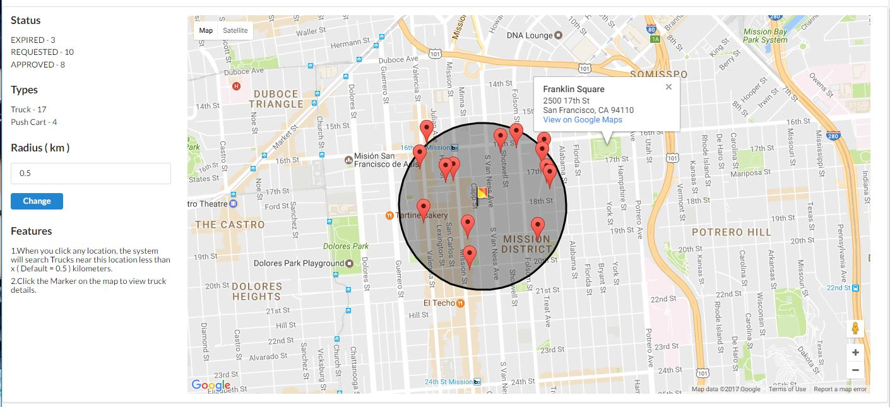
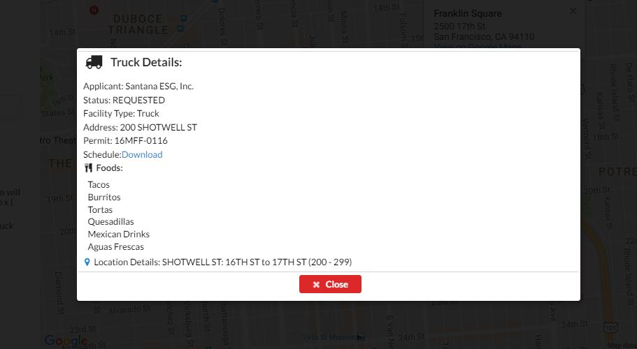
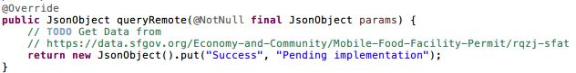
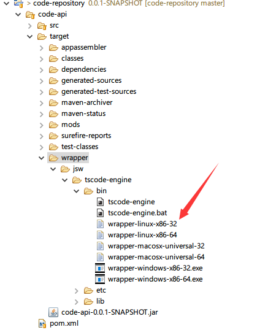

# Puzzle 2: Coding Challenge

## 1. Question

**Foods**

Create a service that tells the user what types of food trucks might be found near a specific location on a map.

## 2. Published Access URL

This application has been deployed on Microsoft Azure Cloud Platform, please visit following URL to open:

<http://codexlang.centralus.cloudapp.azure.com/ts/demo>

**Please be sure your network could access Google Map Api, also you should connect to VPN to access above URL in China.**

Screen Shots

## 3. Features

1. The trucks information will display on this page grouped by **"Status"** and **"Types"**
2. You could set searching radius to know each truck location on map, the unit is km ( kilometers )
3. You can click any location on right map, the system will re-calculate the trucks location on the map and re-paint the map
4. Click one of all trucks Marker on the map, you should see the second screen to show truck details.

## 4. Brief Description

**Attention**

1. In current version, the data came from static json data, but there is a TODO mark to leave implementation in future if needed.

2. All Front-End are based on ES6 javascript, please use Babel, Webpack tool to transfer language
3. Because of Embedded Http Server, you could do more fine grit implementations on Server Level instead of Application Level

**Back-End**

* [Vert.X Framework (Java)](http://vertx.io/docs/): ( Reactor, Event Driving Model Framework, Embedded Http Server, Restful )
* [Java Wrapper Service](http://wrapper.tanukisoftware.com/doc/english/introduction.html)

**Front-End - SPA**

* [React JS](https://facebook.github.io/react/)
* [Redux](http://redux.js.org/)
* [Redux Form](http://redux-form.com/6.5.0/examples/)
* [Superagent](https://visionmedia.github.io/superagent/)
* [Q](https://github.com/kriskowal/q)
* [Semantic UI](http://semantic-ui.com/introduction/getting-started.html)
* [LokiJS](https://rawgit.com/techfort/LokiJS/master/jsdoc/index.html)
* NodeJS

## 5. Deployment

**Back-End**

Please use Maven tool to build the whole project: ( code-repository ), this project used Java Wrapper Service Plugin, there are completed deployed application generated as following:

*There are boot scripts generated based on different operation system, please modify configuration file "/etc/config/server.properties" to publish this Api. ( Port, Host )*

**Front-End**

1. Please install tools in global environment

		npm install -g better-npm-run babel-cli
2. Prepare basic environment under folder "code-app"

		npm install
3. Build/Deploy production Front-End app

		better-npm-run deploy:prod
4. Run Code app

		better-npm-run start:prod

*Basic configuration information refer to src/seed/vie.json, please modify HOST, REST info to point Back-End ( Port, Host ) **before** you do step 3, also please ignore SOCK configuration and it's for mobile and local cache that works with LokiJS*

## Summary

This project is only for demo and could not move to production environment directly. 

