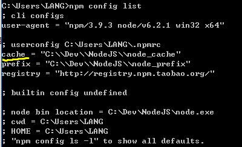
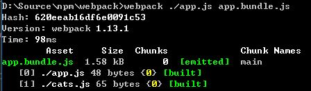
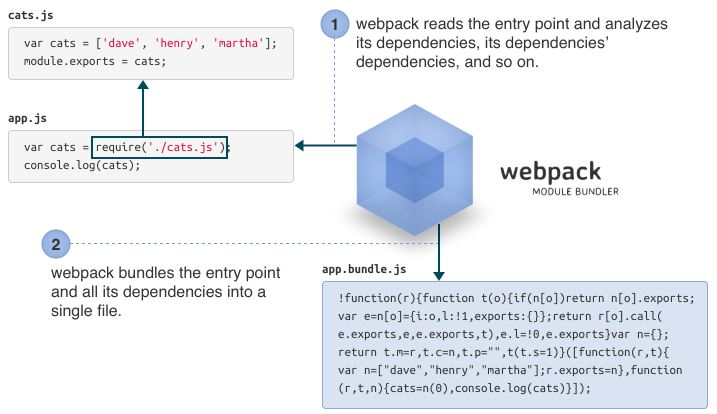
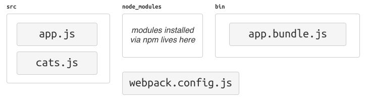
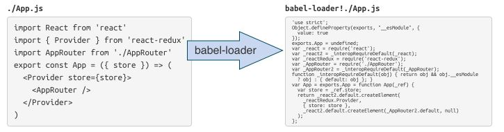
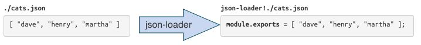
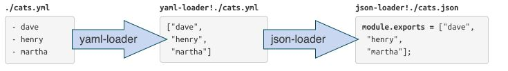

# WebPack Module Bundler - Basic

## 1. What is webpack？

__webpack__ is a __module bundler__. webpack takes modules with dependencies and generates static assets representing those modules.

### Why another module bundler？

Existing module bundlers are not well suited for big projects (big single page applications). The most pressing reason for developing another module bundler was Code Splitting and that static assets should fit seamlessly together through modularization.

I tried to extend existing module bundlers, but it wasn’t possible to achieve all goals.

### Goals

* Split the dependency tree into chunks loaded on demand
* Keep initial loading time low
* Every static asset should be able to be a module
* Ability to integrate 3rd-party libraries as modules
* Ability to customize nearly every part of the module bundler
* Suited for big projects

### How is webpack different?

__Code Splitting__

webpack has two types of dependencies in its dependency tree: sync and async. Async dependencies act as split points and form a new chunk. After the chunk tree is optimized, a file is emitted for each chunk.

__Loaders__

webpack can only process JavaScript natively, but loaders are used to transform other resources into JavaScript. By doing so, every resource forms a module.

Clever Parsing

webpack has a clever parser that can process nearly every 3rd party library. It even allows expressions in dependencies like so `require("./templates/" + name + ".jade")`. It handles the most common module styles: CommonJs and AMD.

## 2. Installation

### node.js

Install node.js. node.js comes with a package manager called `npm`.

### webpack

webpack can be installed through `npm`:

	$ npm install webpack -g
webpack is now installed globally and the `webpack` command is available.

### Use webpack in a project

t’s best to have webpack as a dependency in your project. Through this you can choose a local webpack version and will not be forced to use the single global one.

Add a `package.json` configuration file for `npm` with:

	$ npm init
The answers to the questions are not so important if you don’t want to publish your project to npm. Install and add `webpack` to the `package.json` with:

	$ npm install webpack --save-dev

### Versions

There are two versions of webpack available. The stable one and a beta version. The beta version is marked with a `-beta` in the version string. The beta version may contain fragile changes or experimental features and is less tested. See changelog for differences. For serious stuff you should use the stable version:

	$ npm install webpack@1.2.x --save-dev

### Dev Tools

If you want to use dev tools you should install it:

	$ npm install webpack-dev-server --save-dev

## 3.Usage

### Installation

You can install webpack via npm:

	npm install webpack -g

___Note__: We’re installing webpack globally for demonstration purposes. When you are building a real application, it’s more advisable to install webpack as a `devDependency` of your project._

### Getting Started

First, we’ll learn the basics of webpack by using just webpack’s command-line interface. 

#### Create a Modular JavaScript Project

Let’s create some modules in JavaScript, using the CommonJs syntax:

__cats.js__

	var cats = ['dave', 'henry', 'martha'];
	module.exports = cats;
__app.js ( Entry Point )

	cats = require('./cats.js');
	console.log(cats);
The “entry point” is where your application will start, and where webpack will start tracking dependencies between modules.

#### webpack in 5 seconds

Give webpack the entry point (app.js) and specify an output file (app.bundle.js):

	webpack ./app.js app.bundle.js

webpack will read and analyze the entry point and its dependencies (including transitive dependencies). Then it will bundle them all into app.bundle.js.

Now your bundle is ready to be run. Run `node app.bundle.js` and marvel in your abundance of cats.

	node app.bundle.js
	["dave", "henry", "martha"]
You can also use the bundle in the browser.

### Getting Serious

webpack is a very flexible module bundler. It offers a lot of advanced features, but not all features are exposed via the command-line interface. To gain full access to webpack’s flexibility, we need to create a “configuration file.”

#### Project Structure

In real-world webpack projects, we’ll separate the source files from the bundled files by organizing them in folders. For this example, we’ll put the source files in `src`, and bundled files in `bin`.

Our final project structure will look like this:

_In the wild, there are many project structures. Some projects use `app` instead of `src`. Some projects use `dist` or `build` instead of `bin`. Projects with test usually use `test, tests, spec, specs` or colocate the test files in the source folder._

1. Create the `bin` and `src` directory.

		mkdir bin
		mkdir src
2. Move the original source files to the `src` folder.

		mv app.js cats.js src
3. Initialize an npm project

		npm init 		# ( answer the question )
4. Install webpack as a development dependency. This lets your project declare the version of webpack it is compatible with.

		npm install --save-dev webpack
#### Moving to a configuration file.
As your project grows and your configuration becomes more complex, it becomes unwieldy to configure webpack from the command line. Let’s create a configuration file instead.

1. Create `webpack.config.js`

		module.exports = {
			entry: './src/app.js',
			output: {
				path: './bin',
				filename: 'app.bundle.js'
			}
		};
_Note: A webpack configuration file is a Node-style module. So you can run any kind of code here, as long as a configuration object is exported out of this module._
2. With the configuration file in place, you can now simply run webpack like this:

		webpack
_Note: webpack will read the configuration file, build the bundle, and save it as bin/app.bundle.js. If you examine webpack’s output you’ll see that it included both source files._
3. Run `bin/app.bundle.js` and you’ll get your list of cats again.

		 node bin/app.bundle.js
		 ["dave", "henry", "martha"]
You can also `require()` modules installed via npm with no extra configuration.

#### Using Loaders

webpack only supports JavaScript modules natively, but most people will be using a transpiler for ES2015, CoffeeScript, TypeScript, etc. They can be used in webpack by using “loaders.”

Loaders are special modules webpack uses to ‘load’ other modules (written in another language) into JavaScript (that webpack understands). For example, `babel-loader` uses Babel to load ES2015 files.

`json-loader` loads JSON files (simply by prepending `module.exports` = to turn it into a CommonJs module).

Loaders can be chained, and sometimes you need to chain loaders together. For example, `yaml-loader` only converts YAML into JSON. Therefore, you need to chain it into json-loader so that it can be used.

#### Transpiling ES2015 using `babel-loader`

In this example, we’re going to tell webpack to run our source files through Babel so we can use ES2015 features.

1. Install Babel and the presets:

		npm install --save-dev babel-core babel-preset-es2015
2. Install `babel-loader`:

		npm install --save-dev babel-loader		
3. Configure Babel to use these presets by adding `.babelrc`

		{ "presets": [ "es2015" ] }
4. Modify `webpack.config.js` to process all `.js` files using `babel-loader`.

        module.exports = {
        	entry : './src/app.js',
        	output : {
        		path : './bin',
        		filename : 'app.bundle.js'
        	},
        	module : {
        		loaders : [{
        					test : /\.js$/,
        					exclude : /node_modules/,
        					loader : 'babel-loader'
        					,
        				}]
        	}
        }
_We are excluding `node_modules` here because otherwise all external libraries will also go through Babel, slowing down compilation._
5. Install the libraries you want to use (in this example, jQuery):

		npm install --save jquery babel-polyfill
_We are using `--save` instead of `--save-dev` this time, as these libraries will be used in runtime. We also use `babel-polyfill` so that ES2015 APIs are available in older browsers._
6. Edit `src/app.js`

        import 'babel-polyfill';
        import cats from './cats';
        import $ from 'jquery';
        
        $(function() {
            $('<h1>Cats</h1>').appendTo('body');
            const ul = $('<ul></ul>').appendTo('body');
            for (const cat of cats) { 
                $('<li></li>').text(cat).appendTo(ul);
            }
        });
7. Bundle the modules using webpack:

		webpack
8. Add `index.html` so this app can be run

		<!DOCTYPE html><body>
		
There are a number of different loaders you can use to include files in your app bundle, including css and image loaders.

#### Using Plugins

Usually you’ll want to do some additional processing of the bundle in your workflow. An example would be minifying your file so that clients can load it faster. This can be done with plugins. We’ll add the uglify plugin to our configuration:

        const webpack = require('webpack');
        
        module.exports = {
            entry: './src/app.js',
            output: {
                path: './bin',
                filename: 'app.bundle.js',
            },
            module: {
                loaders: [{
                    test: /\.jsx?$/,
                    exclude: /node_modules/,
                    loader: 'babel',
                }]
            },
            plugins: [
                new webpack.optimize.UglifyJsPlugin({
                    compress: {
                        warnings: false,
                    },
                    output: {
                        comments: false,
                    },
                }),
            ]
        }
The Uglify plugin is included with webpack so you don’t need to add additional modules, but this may not always be the case. You can write your own custom plugins. For this build, the uglify plugin cut the bundle size from 1618 bytes to 308 bytes.

