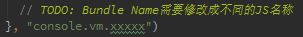

# Module开发手册
## 1.Template项目架构说明

	- core
		- Action					# 模块中需要使用的Action逻辑处理代码
		- ActionHandler				# 模块中执行状态迁移的ActionHandler逻辑处理代码
		- ActionTypes				# 模块中的Action Types对应表，定义了Action种类
		- Container					# 用于连接Redux的核心代码，触发Connect方法
		- Reducer					# 该模块需要使用的Reducer组件的代码
	- data
		- package.json				# 一般不改变，触发data目录的目录导入
		- data.js					# 当前模块需要使用的静态配置数据脚本接口，用于连接多语言
		- cn						# 中文数据语言包
			- data.json				# 中文语言语言文件，如果有多个则需要修改data.js文件执行合并
	- routes
		- package.json				# 一般不改变，触发routes目录的目录导入
		- routes.js					# 当前Module使用的路由文件
	- ui
		- Content.js				# 当前Module使用的React组件定义文件
		- Content.scss				# 当前Module中React组件使用的风格文件
	- module.js						# 当前Module的配置文件

## 2.Module开发步骤

1. 【模块配置】对于Module的基本配置在`module.js`中直接修改，仅仅修改模块名称即可： 

		- module.js
2. 【数据配置】Module中需要使用的数据文件编辑，直接编辑`data/cn/data.json`以及`data/data.js`

		- data/cn/data.json
		- data/data.js
	1. 如果仅仅需要一个数据文件，则直接使用`data/cn/data.json`，不修改`data/data.js`;
	2. 如果需要多个数据文件，则需要在`data/data.js`中修改数据文件最终合并的最终状态；
3. 【路由修改】修改`routes.js`文件修改当前模块需要使用的路由配置；

		- routes/routes.js
	1. 修改路由路径信息： 

	2. 修改发布路由过后的JS脚本文件名：（这个不可动态设置，只能静态文件名） 

4. 【React Component开发】开发界面的React Component组件信息 

		- ui/Content.js
		- ui/Content.scss

5. 【Reducer开发】开发Reducer对应初始化状态信息

		- core/Reducer.js

6. 【Container连接开发】开发Container中对应的Dispatch -> Props以及State -> Props的Mapping处理

		- core/Content.js

---
（上边的开发完成过后基本的组件架构就完成了，下边的步骤用于开发这个组件中对应的Action信息）

1. 【Action定义】修改ActionTypes的信息定义当前组件中需要使用的Action的数量

		- core/ActionTypes.js

2. 【Action逻辑】修改Action的信息处理Action触发的基本逻辑信息

		- core/Core.js

3. 【Handler中的状态迁移】修改ActionHandler的信息处理状态迁移信息

		- core/ActionHandler.js

## 3.Summary

最后，如果有其他Module开发的问题可参考login模块的开发部分，目前login部分已经全部完成了！

