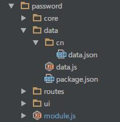
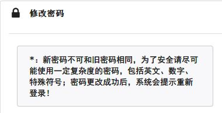

# Configuration File

* `<module>/data/<language.code>/data.json` 

## Segment

	{
	  "ui": {
	    "title": "修改密码",
	    "comment": "*：新密码不可和旧密码相同，为了安全请尽可能使用一定复杂度的密码，\ 
			包括英文、数字、特殊符号；密码更改成功后，系统会提示重新登录！"
	  },
	  "form": {
	    "fPassword": {
	      "field": {
	        "username": {
	          "label": "账号",
	          "icon": "user",
	          "type": "TextBox",
	          "readonly": true
	        },
	        "opassword": {
	          "label": "旧密码",
	          "hint": "输入旧密码",
	          "icon": "remove",
	          "type": "PasswordBox"
	        },
	        "npassword": {
	          "label": "新密码",
	          "hint": "输入新密码",
	          "icon": "lock",
	          "type": "PasswordBox"
	        },
	        "cpassword": {
	          "label": "密码确认",
	          "hint": "确认新密码",
	          "icon": "checkmark",
	          "type": "PasswordBox"
	        }
	      },
	      "action": {
	        "submit": {
	          "text": "更新密码",
	          "focus": "secondary",
	          "type":"HANDLE",
	          "click": "fnUpPassword"
	        },
	        "reset": {
	          "text": "重置",
	          "type":"RESET"
	        }
	      },
	      "validate": {
	        "required": {
	          "opassword": "请输入旧密码，旧密码不可为空！",
	          "npassword": "请输入新密码，新密码不可为空！",
	          "cpassword": "请再次输入新密码！"
	        },
	        "diff": {
	          "npassword": {
	            "error": "新密码不能和旧密码相同，请重新输入！",
	            "target": "opassword"
	          }
	        },
	        "same": {
	          "cpassword": {
	            "error": "两次输入的新密码不相同，请重新输入！",
	            "target": "npassword"
	          }
	        }
	      }
	    }
	  }
	}

## 1.Attributes

### 1.1.Page

	"ui":{
		"title":"",
		"comment":""
	}
* ui节点定义了当前整个页面所需要的基本页面信息，基本页面属性包含下边内容：
	* title：页面标题
	* comment：页面基本说明（可用可不用）
* 下边截图使用了title和comment的情况 

### 1.2.Form

	"form":{
		"<formId>":{
			"field":{
				"<field.name>":{
					"label":"",
					"icon":"",
					"hint":"",
					"type":"",
					"readonly":""
				}
			},
			"action":{
				"<button>":{
					"text":"",
					"focus":"",
					"status":"",
					"click":""
				}
			},
			"validate":{
				"required":{
					"<field.name>":""
				},
				"diff":{
					"<field.name>":{
						"error":"",
						"target":"<another.field.name>"
					}
				},
				"same":{
					"<field.name>":{
						"error":"",
						"target":"<another.field.name>"
					}
				}
			}
		}
	}

1. Form属性： `<formId>`：当前Form的ID，该ID会用于`redux-form`中（对应代码中的`__ID`变量）：

			Content = reduxForm({
			  form: __ID,
			  validate: value => (MOD.$$.VALVE.validate(__RULE, value)),
			  initialValues: __INIT
			})(Content);
	如果当前Page中包含多个Form则可以添加新的Form配置信息（一般只有一个Form）
2. Field属性：`field`：当前Form中包含的字段信息，该节点为一个Object对象

		"field":{
	        "username": {
	          "label": "账号",
	          "icon": "user",
	          "type": "TextBox",
	          "readonly": true,
	          "required": true,
	        },
			......
		}
	* `username`：Object的键为字段名称，绑定到input元素的name属性中；
	* `label`：当前字段前边的标签，显示在字段上的文字信息（可国际化）；
	* `hint`：当前字段的提示信息，绑定到input元素的placeholder属性中；
	* `icon`：当前字段的左边是否使用icon图标修饰；
	* `type`：必须是自定义控件名，该控件为`React.Component`子类组件名；
	* `readonly`：当前字段是否只读，只读字段颜色上会有少许差异；
	* `required`：当前字段是否必填；
3. Action属性：`action`：当前Form中需要使用的Button控件，该节点同样为一个Object对象

	      "action": {
	        "submit": {
	          "text": "更新密码",
	          "focus": "secondary",
	          "type":"HANDLE",
	          "click": "fnUpPassword"
	        },
	        "reset": {
	          "text": "重置",
	          "type":"RESET"
	        }
	      },
	* `submit | reset`：只是按钮的名称，为了标识当前按钮而存在；
	* `text`：按钮上显示的文字；
	* `focus`：对应Semantic UI上的按钮修饰，影响按钮本身的外观，默认无颜色；
	* `type`：按钮类型，用于控制重复提交，目前支持两个值：
		* HANDLE：用于提交函数，必须提供click；
		* RESET：用于重置表单，不需要提供click；
	* `click`：触发按钮的操作对应的JavaScript函数，该函数必须在Redux的Action中定义过；
4. Validate属性见下边章节！

### 1.3.Validation Rule

			"validate":{
				"required":{
					"<field.name>":""
				},
				"diff":{
					"<field.name>":{
						"error":"",
						"target":"<another.field.name>"
					}
				},
				"same":{
					"<field.name>":{
						"error":"",
						"target":"<another.field.name>"
					}
				}
			}

* required：必须填写的字段；
* diff：将当前字段和target中的字段值进行对比，两个字段值必须不同；
* same：将当前字段和target中的字段值进行对比，两个字段值必须相同；