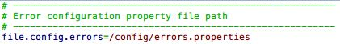
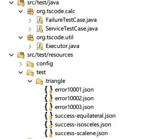
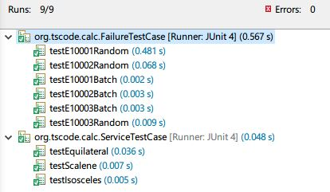
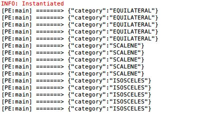

# Puzzle 1: Triangle challenge

## Description

Write a program that will determine the type of a triangle. It should take the lengths of the triangle's three sides as input, and return whether the triangle is equilateral, isosceles or scalene.

## Design

This program is built with three modules

* **code-repository**：Parent project to provide uniform version of java dependency library
* **code-puzzle**：The core library that shared between each module that provide some utility tool/abstract class/interface
* **code-shape**：Tringle challenge small system
* **code-api**：This project is reserved to provide Restful Api for future using

### 1.Basic Library.

* [OVAL - Object Validation Framework](http://oval.sourceforge.net/userguide.html): This framework provide validation in java language to support defensive programming with AOP mode
* [Vert.X](http://vertx.io/docs/): Event Driving Took-kit to implement web application in reactor mode, because it contains Jackson Library, this framework also provide Serialization/Deserialization future for current project.
* [AspectJ](http://www.eclipse.org/aspectj/doc/released/progguide/index.html)：This framework provide complete feature to support put some logical in AOP and it's dependency library that OVAL used.

### 2.Configurations

#### 2.1.Structure

	/aop/aopaj-test.properties
	/aop/aopaj.properties
	/config/errors.properties
	/config.properties
	/log4j.properties

* **aopaj-test.properties, aopaj.properties**: Both files are required for Maven Mojo AspactJ Plugin, it's used to configure source code that be applied to AspectJ Runtime
* **log4j.properties**：Enable log4j-slf4j
* **config.properties**：Root config file that provide dispatching feature to connect different config files.

* **config/errors.properties**：Provide uniform error format, ( code = pattern ), all errors are defined in this file and could be configured. It's using for Debug or some errors could be put in web response to user.

#### 2.2.Package

* `org.tscode.aop`：Special package to provide all AOP features
* `org.tscode.cv`：Constant values, all constant values are implemented with Java Interface
* `org.tscode.exp`：All user-defined exceptions are in this package or sub-packages, **AbstractException** is checked abstract exception and most of sub exceptions should be catched.
* `org.tscode.util`：Utility Tools
* `org.tscode.shape`：All abstract shape features include Point, Line, VectorLine, Traingle ( Container ) here.
* `org.puzzle`：All classes for current **Triangle Challenge** Topic only.

#### 2.3.Core Model

Package:`org.tscode.shape.core`

* `Point
`：Include x,y,z position to provide basic point model, `P` is generic type to define any data to store in.
* `Line<L>`：This model is only for some simple lines, the line contains `length` property, `L` is generic type to define any data to store in.
* `VectorLine<P,L>`:This model inherit from `Line<L>`, it contains two `Point
` and could describe Vector, Line, Planum etc.
* `Response`：This model contains two major parts: Data & Error, data is `Json` format and raw type of Error is AbstractException that also could be converted to `Json` format.

#### 2.4.Interfaces

Package:`org.puzzle`

* `TriangleService`: This interface is often called by Restful Api or other high level code, based on package name it's related to **Triangle Challenge** topic

Package:`org.tscode.shape`

* `Calculator`：This interface provide logical process to describe how to calculate `P` in Point and `L` in Line/VectorLine. It could be replaced by different implementation. In **Triangle Challenge** topic, I defined `org.puzzle.triangle.CatCalculator` to determine whether this triangle is **Equilateral**, **Isosceles** or **Scalene**. 
* `Planum`：Provide following two simple api to create `Shape<P,L>`, it's not generic type but provide generic method to create different Shape by Sides/Points.

		/**
		 * Create Shape -> By Sides
		 * 
		 * @param sides
		 * @return
		 */
		<P, L> Shape<P, L> create(final int... sides) throws AbstractException;
	
		/**
		 * Create Planum -> By Points
		 * 
		 * @param points
		 * @return
		 */
		<P, L> Shape<P, L> create(final Point
[] points) throws AbstractException;
* `Shape<P,L>`: Abstract Shape interface to provide basic metadata getting methods for Shape such as `getPoints, getLines, getData`. A core api for `Shape<P,L>` is `connect(Calculator<P,L> calculator)`, this api could let `Shape<P,L>` to connect different calculator to refresh the data (P,L) inner Shape object. 

		/**
		 * Shape connect to calculator will refresh Data
		 */
		void connect(Calculator<P, L> calculator);

#### 2.5.Extensions/Issues

* All user-defined exceptions could connect to `errors.properties`, there are error details we could use uniform Error Control Center to provide description for any system errors. 
* `Shape<P,L>` provide shape container to store different Shape, not only Triangle but others. It also provide `Container` to store different data structure in Point/Line to help to resolve some problems. **Triangle Challenge** topic does not need `P,L`, so I selected `Integer` instead.
* `Calculator` could be replaced by any user-defined or system-default calculators, the major logical should be in `Calculator Implementation`
* `Service/Planum` should be used in **singleton** model in complex scenario.
* I have marked `TODO` label for unfinished feature that is not used in **Triangle Challenge** topic.

### 3.Test Case

#### 3.1.Code Structure

#### 3.2.Test Workflow

1. Read data from `test/triangle/` folder for different scenario.
2. `Executor` contains major testing code that could be shared between different test cases.
3. Most of testing data format as `Json` and each case could hold more than one group inputes.
4. Because test data format is simple, we could write some generator to produces more testing data and put into test data folder.

#### 3.3.Testing Result

JUnit

Console

### Summary

Althought the topic is simple, but I designed it based on following considering

1. How to extend this module to resolve actual problems that include **Triangle Challenge** topic ?
2. How to defined this topic to produce Container concept for **Reusing** ?