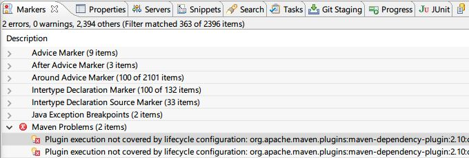
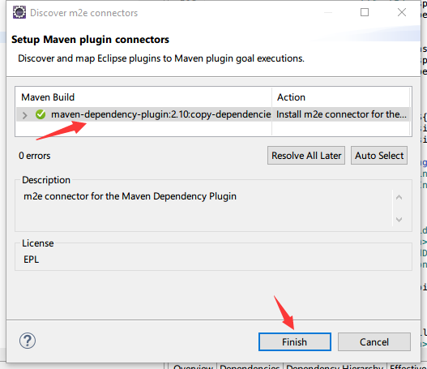

# Issue 1: Maven Problems ( Eclipse )

You may met following issue

**Resolution**

1. Right click item "Plugin execution..."
2. Select "Quick Fix" ( Ctrl + F1 )
3. In dialog, choose "Select a fix: -> Discover new m2e connectors" and then click "Finish" button
4. Eclipse will search this Plug-In from internet, you should see following screen shot: 

5. Click "Finish" button and install "m2e connector for the Maven Dependency Plugin"
6. Once it's finished, restart Eclipse IDE and this issue has been resolved.